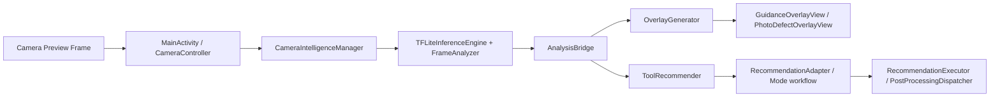

# Android Demo 系统介绍

本文档面向 Android 目录下的 demo 应用与运行时组件，基于当前仓库实现进行说明，并与根目录中的 framework_en.md 保持同一架构口径。

## 1. 文档定位

Android 侧是 Intelligent Camera System 的移动端落地层，负责将训练好的多任务模型以 TFLite 方式接入实时预览，并输出：

- 实时引导叠加层（GuidanceFrame）
- 拍摄参数与工具推荐（ToolRecommendationResult）
- 缺陷定位与后处理建议（按需）

与 Python 侧的关系是：

- Python 侧负责数据、训练、评估、导出
- Android 侧负责模型加载、实时推理、UI 呈现与交互执行

## 2. 目录与模块分层

Android 目录由两部分代码组成：

1. 核心运行时库：android/src/main/java/com/samsung/camera/intelligence/
2. Demo 应用壳层：android/app/src/main/java/com/samsung/camera/intelligence/app/

核心运行时提供可复用能力，Demo 应用负责 Camera 预览、交互面板、设置项与可视化。

## 3. 总体运行架构

核心门面是 CameraIntelligenceManager：

- 管理模型初始化与探针推理
- 每帧调度 FrameAnalyzer 解析输出
- 每帧生成 GuidanceFrame
- 按节流周期更新 ToolRecommendationResult
- 对外统一暴露 processFrame、reset、release 等 API

## 4. 关键类职责

### 4.1 顶层与运行控制

- CameraIntelligenceManager
  - Android 端统一门面
  - 聚合 inference、guidance、recommendation 三大子系统
- ModelAssetSelector（app 层）
  - 选择并加载可用模型
  - 处理默认模型、用户偏好与回退策略
- ModelRuntimeController（app 层）
  - 在 UI 中管理模型切换、运行状态与提示

### 4.2 推理子系统

- TFLiteInferenceEngine
  - 加载 TFLite 模型（支持 GPU delegate）
  - 执行单帧推理，输出原始张量
- ImagePreprocessor
  - Bitmap 到模型输入张量转换
  - 依据 backbone 做归一化
- FrameAnalyzer
  - 对推理输出进行语义解码
  - 组装 FrameAnalysis
- SegmentationRunner / UnifiedSegmentationDecoder
  - 处理分割输出并生成缺陷区域信息（按模型能力与调用场景启用）

### 4.3 引导子系统

- AnalysisBridge
  - FrameAnalysis 与 SceneAnalysisResult 互转
  - 对齐推荐引擎输入结构
- OverlayGenerator
  - 统一生成叠加层并做去重、限流、稳定化
- CompositionGuide / AngleGuide / TechnicalGuide
  - 分层生成构图、角度、技术提示
- TemporalSmoother
  - 降低帧间抖动与提示闪烁

### 4.4 推荐子系统

- ToolRecommender
  - 将场景结果映射为模式、参数、工具链建议
- ParameterOptimizer / ExposureMapper
  - 细化参数建议（ISO、快门、EV、WB 等）
- DefectLocalizer
  - 对缺陷区域做空间定位，用于后处理建议联动

### 4.5 Demo UI 子系统（app）

- MainActivity
  - Demo 主入口，整合预览、叠加、模式建议、后处理列表
- GuidanceOverlayView
  - 绘制各类 GuidanceOverlay
- PhotoDefectOverlayView
  - 展示缺陷区域与后处理提示
- CameraController / CameraGLPreview / CameraGLRenderer
  - Camera 采集、预览与渲染
- RecommendationExecutor / PostProcessingDispatcher
  - 将推荐结果转成实际动作与流程

## 5. 模型资产与加载策略

当前 app 侧模型选择器使用的关键策略：

- 默认 backbone：clip_vit_b16_220Kshadow
- 兼容回退：clip_vit_b32
- 支持从 APK assets 与外部目录查找模型
- 初始化后执行 probeInference，避免“模型可加载但不可运行”

简化加载顺序：

1. 如果用户显式指定模型：严格按指定模型加载，不自动切换到别的 backbone
2. Auto 模式：优先默认 b16，再回退 b32
3. 失败时返回可诊断的错误信息与尝试路径列表

## 6. 实时帧处理链路

每帧调用 processFrame 时的逻辑：

1. FrameAnalyzer 运行推理与解码，得到 FrameAnalysis
2. OverlayGenerator 每帧生成 GuidanceFrame（低延迟可视反馈）
3. ToolRecommender 按 recommendIntervalMs 节流更新（避免频繁扰动）
4. Demo UI 使用 GuidanceFrame 绘制叠加层，并展示推荐结果

说明：

- 引导输出是高频（帧级）
- 推荐输出是低频（节流）
- 这种设计平衡了流畅性与建议稳定性

## 7. 与 framework_en.md 的层级映射

| framework_en.md 层级 | Android 对应实现 |
|---|---|
| Deployment and Export | convert_cli 导出的 TFLite 由 TFLiteInferenceEngine 加载 |
| Recommendation Layer | ToolRecommender + ParameterOptimizer + ExposureMapper + DefectLocalizer |
| Guidance Layer | AnalysisBridge + OverlayGenerator + Composition/Angle/Technical guides |
| Runtime Landing Layer | CameraIntelligenceManager + MainActivity + CameraController + OverlayView |

Android 侧并不重复训练逻辑，而是承接 Python 侧产物并完成端上闭环。

## 8. Demo 功能边界

Android demo 主要验证以下能力：

- 实时场景分析 + 构图/技术引导
- 模式与参数建议（可联动执行）
- 缺陷识别与后处理建议可视化
- 模型切换、回退与运行状态诊断

不属于 demo 主职责的内容：

- 数据标注、训练、批量评估
- 导出流水线本身（Android 只消费导出结果）

## 9. 开发与调试建议

- 模型相关问题优先检查：ModelAssetSelector 的选择路径与 probeInference 日志
- 叠加层异常优先检查：FrameAnalyzer 输出是否完整、OverlayGenerator 输入是否为空
- 推荐异常优先检查：AnalysisBridge 映射字段与 ToolRecommender 前置条件
- 性能调优优先检查：帧节流、分割开关、GPU delegate 使用情况

## 10. 快速结论

Android 目录下的 demo 系统是 Intelligent Camera System 的移动端运行闭环：

- 以 CameraIntelligenceManager 为核心门面
- 以 TFLiteInferenceEngine + FrameAnalyzer 为推理核心
- 以 OverlayGenerator + ToolRecommender 为业务核心
- 以 MainActivity 与 UI 组件完成可交互演示

它与新版 framework_en.md 的关系是“同一架构在移动端的实现映射”，不是独立的第二套系统。
